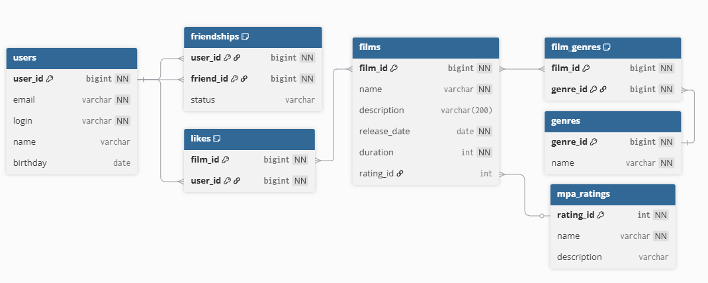

# java-filmorate

# Схема базы данных

### Таблицы:

- **users** — информация о пользователях
- **friendships** — дружба между пользователями
- **likes** — лайки, которые ставят пользователи фильмам
- **films** — информация о фильмах
- **film_genres** — связь между фильмами и жанрами
- **genres** — жанры фильмов
- **mpa_ratings** — возрастные рейтинги фильмов